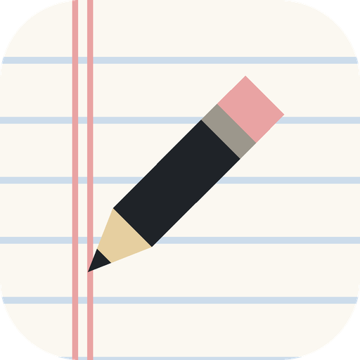

<p align="center">
  
</p>

<h1 align="center">Notas</h1>

<p align="center">
  Um app de notas para Android com cara de folha de caderno.<br>
  Minimalista, offline e escrito todo em <a href="https://www.jetbrains.com/lp/mono/">JetBrains Mono</a>.
</p>

---

## Sobre

O **Notas** é um bloco de anotações simples: abra, escreva e pronto. A interface imita uma folha de caderno pautado, com linhas azuis, margem dupla vermelha e o texto apoiado nas pautas. Não tem conta, nuvem nem anúncios. As notas ficam só no seu aparelho.

## Funcionalidades

- **Folha de caderno**: pautas horizontais e margem dupla. Título, texto e lista são alinhados às linhas, que rolam junto com o conteúdo.
- **Data na margem**: cada nota mostra na margem quando foi editada (`14:32` hoje, `07 out` neste ano, `10/25` em anos anteriores).
- **Salvamento automático**: salva enquanto você digita e ao sair da nota. Notas vazias são descartadas.
- **Busca**: filtra pelo título e pelo conteúdo enquanto você digita.
- **Exclusão em dois toques**: `excluir` vira `confirmar`, para evitar apagar sem querer.
- **Tema claro e escuro**: papel creme com pautas azuis no claro, caderno de capa preta no escuro. Escolha em *opções*: seguir o sistema, sempre claro ou sempre escuro.
- **Tamanho da fonte**: pequena (85%), normal, grande (115%) ou enorme (130%). As pautas acompanham, e o texto continua em cima das linhas.
- **Offline**: nenhuma permissão de internet.

## Stack

| | |
|---|---|
| Linguagem | Kotlin |
| UI | Jetpack Compose + Material 3 |
| Arquitetura | `ViewModel` + `StateFlow` |
| Armazenamento | Notas em JSON no armazenamento interno (`filesDir/notes.json`); opções em `SharedPreferences` |
| Fonte | JetBrains Mono (Regular, Medium, Bold), embutida em `res/font` |
| Android | minSdk 26 (Android 8.0), targetSdk 37 |

## Como rodar

**Pelo Android Studio**

1. Abra a pasta do projeto no Android Studio.
2. Espere o Gradle sincronizar.
3. Escolha um emulador ou celular e clique em **Run ▶**.

**Pelo terminal**

O Gradle precisa de um JDK. O que vem com o Android Studio serve:

```bash
# Windows (Git Bash)
export JAVA_HOME="/c/Program Files/Android/Android Studio/jbr"

./gradlew assembleDebug      # gera app/build/outputs/apk/debug/app-debug.apk
./gradlew installDebug       # instala no aparelho conectado
```

## Estrutura

```
app/src/main/
├── java/com/notas/app/
│   ├── MainActivity.kt          # navegação entre lista, editor e opções
│   ├── NotesViewModel.kt        # busca, salvamento com atraso, exclusão, opções
│   ├── data/
│   │   ├── Note.kt              # modelo da nota
│   │   ├── NoteRepository.kt    # leitura e escrita do JSON
│   │   └── SettingsRepository.kt # tema e tamanho da fonte
│   └── ui/
│       ├── NotebookPaper.kt     # pautas, margem e alinhamento do texto
│       ├── NotesListScreen.kt   # tela de lista
│       ├── NoteEditorScreen.kt  # tela de edição
│       ├── SettingsScreen.kt    # tela de opções
│       ├── DateFormat.kt        # datas em pt-BR
│       └── theme/               # cores, fonte e tema
└── res/
    ├── drawable/                # ícone (vetores: folha + lápis)
    ├── font/                    # JetBrains Mono
    └── mipmap-anydpi/           # ícone adaptativo
```

### Como a folha funciona

Tudo gira em torno de uma constante em `NotebookPaper.kt`:

```kotlin
val RuleHeight = 32.sp   // distância entre as pautas
```

As pautas são desenhadas a cada `RuleHeight`, e todo texto sobre a folha usa `lineHeight = RuleHeight` (via `TextStyle.onRule()`), com as letras alinhadas na parte de baixo da linha. Por isso o texto sempre cai em cima de uma pauta. Como o valor está em `sp`, o espaçamento acompanha o tamanho de fonte do sistema e o escolhido em *opções*. O tema aplica essa escala multiplicando o `fontScale`. A altura da pauta é arredondada para pixels inteiros (`rulePx()`), para que texto e linhas não se desencontrem em notas longas.

Para mudar as cores do papel, das pautas ou da margem, edite `ui/theme/Color.kt`.

## Ícone

Ícone adaptativo em vetor: folha pautada com margem no fundo e um lápis na frente. Também tem uma camada monocromática para os ícones temáticos do Android 13+. Os arquivos ficam em `res/drawable/ic_launcher_background.xml` e `ic_launcher_foreground.xml`.

## Créditos

- Fonte [JetBrains Mono](https://github.com/JetBrains/JetBrainsMono), da JetBrains, sob a licença SIL Open Font License 1.1 (cópia em [`licenses/JetBrainsMono-OFL.txt`](licenses/JetBrainsMono-OFL.txt)).
